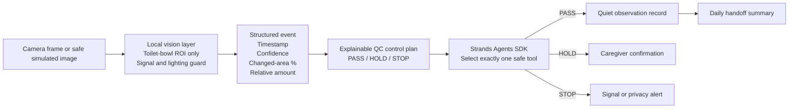

# Yasashii Bowel Care Agent

A privacy-first AI agent for family caregivers, prepared for the **Agents for Humans Hackathon**.

The project turns a minimal, non-identifying observation from a local vision layer into one of three safe actions:

- **PASS** — quietly record a high-confidence observation;
- **HOLD** — ask a caregiver for `Yes / No / Hold`;
- **STOP** — stop automation when signal health or privacy controls fail.

It is an observation and handoff aid, **not a medical diagnostic device**.

## Why this matters

Family caregivers may repeatedly need to check whether a bowel movement likely occurred, estimate a relative amount, record the event, and share the information with other caregivers. This project explores how an agent can reduce that repetitive work without removing human judgment or compromising dignity.

## What is new during the hackathon

A basic local bowel-monitoring prototype existed before the submission period. It is disclosed as pre-existing work.

The hackathon work adds:

- a **Strands Agents SDK** orchestration layer;
- an explainable confidence and quality-control policy;
- human confirmation for uncertain observations;
- safe stop behavior when privacy or signal checks fail;
- privacy-minimized event logging;
- daily handoff summaries.

## QC method

The agent uses a small control plan inspired by practical QC:

1. **Standardize the input** — validate one structured event schema.
2. **Check critical-to-quality conditions** — privacy flag, signal health, event type, relative amount, and confidence.
3. **Separate PASS / HOLD / STOP** — uncertainty never becomes a fact.
4. **Record reasons** — every decision has an explainable control status and reason code.
5. **Improve with PDCA** — test examples and logs can be reviewed to refine thresholds and usability.

See [`docs/qc_method.md`](docs/qc_method.md).

## Architecture



More detail: [`docs/architecture.md`](docs/architecture.md).

## Repository layout

```text
yasashii-bowel-care-agent/
├── src/
│   ├── agent.py          # Strands agent and safe action tools
│   ├── qc_policy.py      # Deterministic, explainable QC control plan
│   └── handoff.py        # Privacy-minimized daily summary
├── sample_data/          # Synthetic JSON events only
├── tests/                # QC policy tests
├── docs/
├── requirements.txt
└── LICENSE
```

## Quick start

Python 3.10 or later is required.

```bash
cd yasashii-bowel-care-agent
python -m venv .venv
source .venv/bin/activate
pip install -r requirements.txt
```

### 1. Test the QC logic without AWS

This mode validates the event and prints the decision. It does not call a model or write care records.

```bash
python src/agent.py \
  --event sample_data/uncertain_event.json \
  --dry-run
```

Try the three control outcomes:

```bash
python src/agent.py --event sample_data/high_confidence_event.json --dry-run
python src/agent.py --event sample_data/uncertain_event.json --dry-run
python src/agent.py --event sample_data/bad_signal_event.json --dry-run
```

### 2. Run the Strands agent

Configure AWS credentials with permission to use the selected Amazon Bedrock model, then run:

```bash
python src/agent.py \
  --event sample_data/uncertain_event.json \
  --runtime-dir runtime
```

The Strands agent receives both the structured event and the explainable QC decision, then calls exactly one tool:

- `record_observation`
- `request_caregiver_confirmation`
- `stop_and_check_signal`

Runtime JSONL files are local and excluded from Git.

### 3. Create a daily handoff summary

```bash
python src/handoff.py --runtime-dir runtime --date 2026-08-18
```

## Run tests

```bash
pip install -r requirements-dev.txt
pytest -q
```

Current public QC test set: **5 tests** covering PASS, HOLD, unhealthy signal, personal-data stop, and the rule that `no_event` must not be silently recorded as proof of no bowel movement.

## Privacy and safety

- Public examples are synthetic; no real patient images or care records are included.
- The agent does not need a person's name, face, address, or account identity.
- Raw images are not required after a structured event is produced.
- Runtime logs and local settings are ignored by Git.
- No AWS credentials, tokens, Wi-Fi information, or private configuration belong in this repository.
- Uncertainty is escalated to a human.
- The output is not a diagnosis and does not replace professional care.

See [`docs/publication_safety.md`](docs/publication_safety.md).

## Pre-existing work disclosure

**Pre-existing, disclosed:** local toilet-water-region monitoring, possible-event detection, changed-area measurement, relative amount classification, CSV logging, and privacy/signal guards.

**New during the hackathon:** Strands orchestration, the PASS/HOLD/STOP confidence policy, human-confirmation tools, safe-stop tooling, handoff summaries, and the end-to-end agent workflow.

## Built with

- Python
- Strands Agents SDK
- Amazon Bedrock model provider
- Structured computer-vision event inputs
- JSONL / local event logging
- Pytest

## License

MIT License — see [`LICENSE`](LICENSE).
