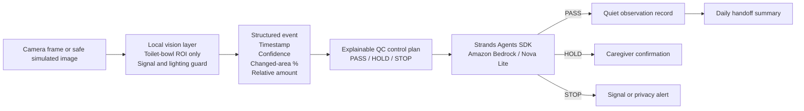

# Yasashii Bowel Care Agent

A privacy-first AI agent for family caregivers, prepared for the **Agents for Humans Hackathon**.

The project turns a minimal, non-identifying observation from a local vision layer into one of three safe actions:

- **PASS** — quietly record a high-confidence observation;
- **HOLD** — ask a caregiver for `Yes / No / Hold`;
- **STOP** — stop automation when signal health or privacy controls fail.

It is an observation and handoff aid, **not a medical diagnostic device**.

## Why this matters

Family caregivers may repeatedly need to check whether a bowel movement likely occurred, estimate a relative amount, record the event, and share the information with other caregivers. This project explores how an agent can reduce that repetitive work without removing human judgment or compromising dignity.

The hackathon's ideal agent runs quietly in the background and only surfaces when a person genuinely needs to decide something. That is the product behavior this project is targeting.

## What is new during the hackathon

A basic local bowel-monitoring prototype existed before the submission period. It is disclosed as pre-existing work.

The hackathon work adds:

- a **Strands Agents SDK** orchestration layer;
- an explicit Amazon Bedrock model configuration;
- an explainable confidence and quality-control policy;
- human confirmation for uncertain observations;
- safe stop behavior when privacy or signal checks fail;
- privacy-minimized event logging;
- daily handoff summaries;
- a repeatable three-case demo path for PASS / HOLD / STOP.

## QC method

The agent uses a small control plan inspired by practical QC:

1. **Standardize the input** — validate one structured event schema.
2. **Check critical-to-quality conditions** — privacy flag, signal health, event type, relative amount, and confidence.
3. **Separate PASS / HOLD / STOP** — uncertainty never becomes a fact.
4. **Record reasons** — every decision has an explainable control status and reason code.
5. **Improve with PDCA** — test examples and logs can be reviewed to refine thresholds and usability.

See [`docs/qc_method.md`](docs/qc_method.md).

## Architecture



More detail: [`docs/architecture.md`](docs/architecture.md).

## Default Bedrock model

The project now uses an explicit default instead of relying on the Strands SDK's changing default model:

- model / inference profile: `us.amazon.nova-lite-v1:0`
- region: `us-east-1`
- temperature: `0.0` for stable tool selection

Override these without changing code:

```bash
export YASASHII_BEDROCK_MODEL_ID=us.amazon.nova-lite-v1:0
export YASASHII_AWS_REGION=us-east-1
```

AWS credentials are obtained from the standard AWS SDK credential chain. **No AWS keys belong in this repository.**

## Repository layout

```text
yasashii-bowel-care-agent/
├── src/
│   ├── agent.py              # Strands agent and safe action tools
│   ├── bedrock_preflight.py  # minimal credential + Bedrock access check
│   ├── demo.py               # PASS / HOLD / STOP demo runner
│   ├── handoff.py            # privacy-minimized daily summary
│   ├── model_config.py       # explicit Bedrock model / region settings
│   └── qc_policy.py          # deterministic, explainable QC control plan
├── sample_data/              # synthetic JSON events only
├── tests/                    # QC, model-config, and handoff tests
├── docs/
├── requirements.txt
└── LICENSE
```

## Quick start

Python 3.10 or later is required.

```bash
cd yasashii-bowel-care-agent
python -m venv .venv
source .venv/bin/activate
pip install -r requirements.txt
```

On Windows PowerShell, activate with `.venv\Scripts\Activate.ps1`.

### 1. Test the QC logic without AWS

This mode validates the event and prints the decision. It does not call a model or write care records.

```bash
python src/agent.py \
  --event sample_data/uncertain_event.json \
  --dry-run
```

Run the three demonstration outcomes together:

```bash
python src/demo.py --mode qc
```

Expected control outcomes:

- `high_confidence_event.json` → **PASS**
- `uncertain_event.json` → **HOLD**
- `bad_signal_event.json` → **STOP**

### 2. Prepare AWS safely

Before a live model call:

1. enable MFA on the AWS account;
2. create an AWS Budget / cost alert;
3. confirm Amazon Bedrock access in `us-east-1`;
4. use development credentials or a role rather than storing root credentials.

Then run the minimal preflight. This makes one very small Bedrock request and does not print the AWS account ID or ARN:

```bash
python src/bedrock_preflight.py
```

A successful result has:

```json
{
  "credentials_ok": true,
  "bedrock_ok": true,
  "model_id": "us.amazon.nova-lite-v1:0",
  "region": "us-east-1"
}
```

### 3. Run the live Strands + Bedrock demo

After the preflight succeeds:

```bash
python src/demo.py --mode live
```

The Strands agent receives both the structured event and the deterministic QC decision, then calls exactly one tool:

- `record_observation`
- `request_caregiver_confirmation`
- `stop_and_check_signal`

Runtime JSONL files are local and excluded from Git.

### 4. Create a daily handoff summary

```bash
python src/handoff.py --runtime-dir runtime/demo --date 2026-08-21
```

## Run tests

```bash
pip install -r requirements-dev.txt
pytest -q
```

The public test set covers:

- PASS / HOLD / STOP control behavior;
- personal-data stop behavior;
- the rule that `no_event` must not be silently treated as proof of no bowel movement;
- explicit Bedrock model / region configuration;
- daily handoff summaries that avoid overclaiming.

## Privacy and safety

- Public examples are synthetic; no real patient images or care records are included.
- The agent does not need a person's name, face, address, or account identity.
- Raw images are not required after a structured event is produced.
- Runtime logs and local settings are ignored by Git.
- No AWS credentials, tokens, Wi-Fi information, or private configuration belong in this repository.
- Uncertainty is escalated to a human.
- The output is not a diagnosis and does not replace professional care.

See [`docs/publication_safety.md`](docs/publication_safety.md).

## Pre-existing work disclosure

**Pre-existing, disclosed:** local toilet-water-region monitoring, possible-event detection, changed-area measurement, relative amount classification, CSV logging, and privacy/signal guards.

**New during the hackathon:** Strands orchestration, explicit Bedrock integration, the PASS/HOLD/STOP confidence policy, human-confirmation tools, safe-stop tooling, handoff summaries, and the end-to-end agent workflow.

## Hackathon submission status

Current status is tracked in [`docs/submission_readiness.md`](docs/submission_readiness.md).

Still required before final submission:

- successfully run and capture the **live Strands + Bedrock** three-case demo;
- connect the local vision event output to the agent end to end;
- record a public demo video of at most 5 minutes;
- confirm the final public repository URL and license presentation;
- complete the Devpost final submission fields.

Optional score boosters after the core flow works:

- public live demo;
- Amazon Bedrock AgentCore deployment;
- builder.aws build-journey article.

## Built with

- Python
- Strands Agents SDK
- Amazon Bedrock
- Amazon Nova Lite
- structured computer-vision event inputs
- JSONL / local event logging
- Pytest

## License

MIT License — see [`LICENSE`](LICENSE).
