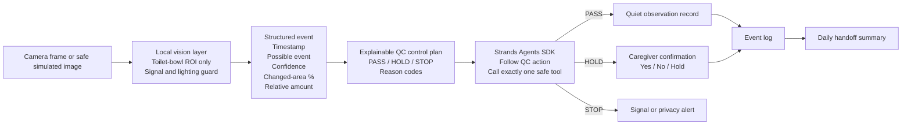

# Architecture

## Boundary between pre-existing and hackathon work

**Pre-existing prototype, disclosed:** local toilet-water-region monitoring, possible-event detection, changed-area measurement, relative amount classification, CSV logging, privacy and signal guards.

**New during the hackathon:** Strands-based orchestration, the explainable PASS/HOLD/STOP policy, human-confirmation and safe-stop tools, privacy-minimized JSONL records, handoff summaries, tests, and the end-to-end agent behavior.

## Why the deterministic QC layer remains outside the model

The local QC policy validates critical conditions before the model is asked to act. This makes the safety boundary inspectable and testable. The Strands agent still performs real orchestration and tool selection, but it is instructed to follow the validated QC action rather than inventing a care fact.

## Safety principles

- Public demos use safe simulated data.
- No medical diagnosis.
- No patient identity is needed by the agent.
- Raw images are not required once the local vision layer has produced a structured event.
- Uncertainty is escalated to a human rather than silently converted into a factual claim.
- A failed signal or privacy check stops automatic recording.
