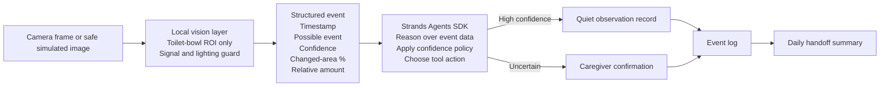

# Architecture

## Boundary between pre-existing and hackathon work

**Pre-existing prototype, disclosed:** local toilet-water-region monitoring, possible-event detection, changed-area measurement, relative amount classification, CSV logging, privacy and signal guards.

**New during the hackathon:** Strands-based orchestration, confidence policy, human-confirmation flow, notifications, handoff summary, and the end-to-end agent behavior.

## Safety principles

- Public demos use safe simulated data.
- No medical diagnosis.
- No patient identity is needed by the agent.
- Raw images are not required once the local vision layer has produced a structured event.
- Uncertainty is escalated to a human rather than silently converted into a factual claim.
